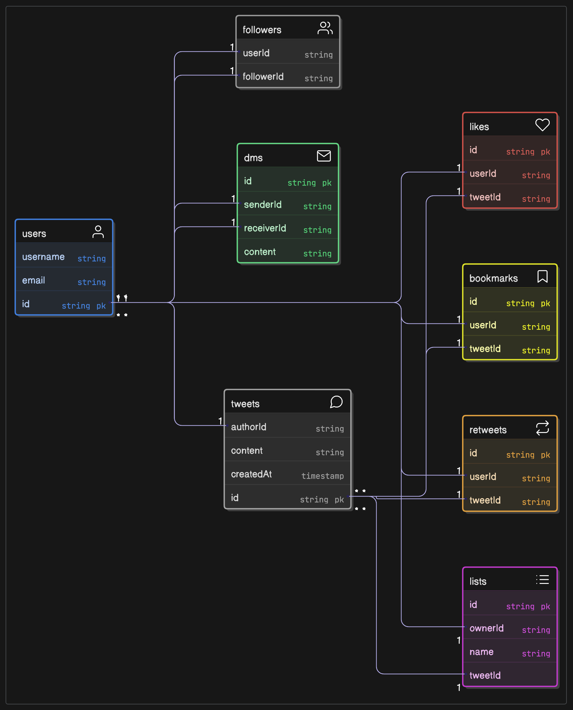

# Twitter Data Model

- Status: Accepted
- Date: 2025-05-21
- Tags: data-model, architecture

## Context

This document describes the data model for the Twitter application, which is designed 
to support various features such as user management, tweets, likes, retweets, direct 
messages, and lists.

## Date Models

The Twitter data model consists of the following key entities:

- **Users**: Represents the users of the platform, including their unique identifiers and contact information.
- **Followers**: Represents the follower relationships between users.
- **Direct Messages (DMs)**: Represents private messages exchanged between users.
- **Likes**: Represents the likes given by users to tweets.
- **Bookmarks**: Represents the bookmarking of tweets by users.
- **Retweets**: Represents the retweets made by users.
- **Tweets**: Represents the tweets created by users, including their content and timestamps.
- **Lists**: Represents user-created lists that can contain tweets.

## Decision Drivers

1. Scalability: The data model should support a large number of users and interactions.
2. Flexibility: The model should allow for easy addition of new features in the future.
3. Performance: The model should ensure efficient querying and data retrieval.

## Decision Outcome

The decision to use the above data model is based on its ability to meet the scalability, flexibility, and performance requirements of the Twitter application. 
The model allows for efficient handling of user interactions and relationships while providing a clear structure for future enhancements.

